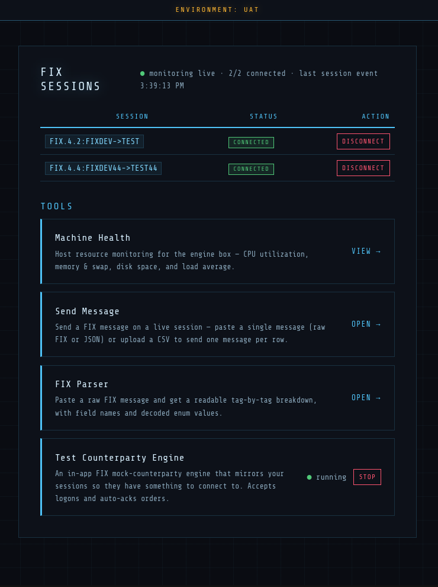

# FIX Connectivity Center

An app built with Rust to manage FIX sessions. It runs a FIX engine (via the [`quickfix`](https://crates.io/crates/quickfix) crate — bindings to the
QuickFIX C++ engine) and serves a status dashboard with tools to monitor host
health and send FIX messages on demand.

## Build & run

Requires a C/C++ toolchain + cmake (the `quickfix` crate builds libquickfix).

    $ cargo run
    Server starting on http://:8081
    Session FIX.4.2:FIXDEV->TEST created.
    Session FIX.4.2:FIXDEV->TEST has logged on.

The dashboard is served on http://localhost:8081 (session status at `/sessions`).
Session details live in `sessions.cfg`. Messages are sent on demand from the
dashboard's Send tool — paste a single FIX/JSON message or upload a CSV batch
(see `send_template.csv` for the accepted CSV format).
